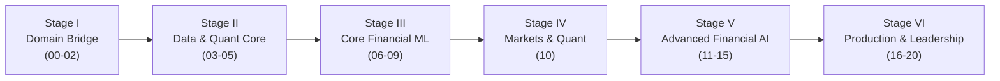

# FinTech AI Engineer Mastery System

> **A complete, expert-level curriculum and engineering laboratory for AI Engineers specializing in Financial Technology.**
> 21 phases · 6 stages · 7 flagship projects · 10 case studies · ~28 datasets · 5 interview tracks · 8 research frontiers.

You already know how to build AI systems. This repository makes you dangerous in the one industry where AI decisions move money, carry legal liability, and get audited: **finance**.

It is designed as a personal **knowledge base + curriculum + portfolio + research lab + career roadmap** — something you maintain for years, in public, on GitHub.

---

## Who This Is For

You are an **AI Engineer** — comfortable with Python, classical ML, deep learning, LLMs, APIs, and production deployment. You are *not* treated as a beginner here. Generic AI content is deliberately excluded unless it changes meaningfully in a financial context.

The target trajectory:

```text
AI Engineer → FinTech AI Engineer → Senior FinTech AI Engineer → FinTech AI/ML Architect / Technical Leader
```

---

## What Makes This Different

| Typical approach | This system |
|---|---|
| Watch courses, collect certificates | Build evidence: every lesson produces an artifact |
| Finance "awareness" then generic ML | Financial domain depth fused with ML from Phase 01 |
| Metric-driven evaluation (AUC only) | Finance-aware evaluation: calibration, cost matrices, expected profit, regulatory defensibility |
| Tutorial projects | 25-project ladder ending in production-grade flagship systems with compliance-by-design |
| Linear consumption | Mastery gates: you do not advance by reading, you advance by proving |

**Optimization target:** not "how much content consumed" but *"how capable are you at solving real financial problems with AI?"*

---

## Repository Map

| Path | What it is |
|---|---|
| [`ROADMAP.md`](ROADMAP.md) | The 6-stage, 21-phase curriculum with dependency graph and pacing |
| [`LEARNING.md`](LEARNING.md) | The learning loop, note system, weekly/daily workflow, revision system |
| [`PROGRESS.md`](PROGRESS.md) | Your trackers: phases, projects, papers, mastery gates |
| [`docs/`](docs/) | Career definition, knowledge map, curriculum architecture, resource map, mastery framework, execution plan, research agenda |
| [`phases/`](phases/) | **The core.** 21 phase folders, each a complete teaching unit (objective → lessons → resources → projects → assessment → checkpoint) |
| [`tracks/`](tracks/) | Cross-cutting progressions: financial mathematics, engineering, AI specialization, finance-aware evaluation |
| [`projects/`](projects/) | The project ladder (25 projects) + 7 detailed flagship specs |
| [`datasets/`](datasets/) | ~28 public financial datasets with leakage/bias annotations and mappings |
| [`case-studies/`](case-studies/) | 10 real financial-AI case studies in decision-cost format |
| [`system-design/`](system-design/) | 6 senior-level FinTech system design problems with solution frameworks |
| [`interview-prep/`](interview-prep/) | 5 interview tracks with question banks and model answers |
| [`research/`](research/) | 8 research field areas: status, key papers, open problems, solo experiments |
| [`papers/`](papers/) · [`books/`](books/) | Curated reading lists, tiered and sequenced |
| [`notes/`](notes/) | Templates for lesson notes, experiment logs, weekly reviews, postmortems |
| [`resources/`](resources/) | Resource hierarchy and selection system |

---

## The Learning Loop (every important topic)

```text
Concept → Why it matters in finance → First principles → Mathematics
→ Financial intuition → Implementation → Real dataset → Experiment
→ Evaluation → Failure analysis → Production considerations
→ Mini project → Assessment → Notes / artifact
```

Every phase README operationalizes this loop. The rule: **no artifact, no progress.**

---

## Start Here: Choose Your Entry Point

| Your goal | Go to |
|---|---|
| Start from the beginning, structurally | [Phase 00 — Orientation & Baseline](phases/00-orientation/README.md) |
| "I know ML, teach me finance fast" | [Phase 01](phases/01-financial-foundations/README.md) → [Phase 02](phases/02-banking-payments-lending/README.md) |
| "I want to build fraud detection" | [Phase 07](phases/07-fraud-payment-intelligence/README.md) → [Flagship 01](projects/flagship/01-real-time-fraud-detection-platform.md) |
| "I want to build credit models" | [Phase 06](phases/06-credit-risk/README.md) → [Flagship 02](projects/flagship/02-credit-risk-decisioning-system.md) |
| "I want to build LLM/RAG systems for finance" | [Phase 12](phases/12-generative-ai-finance/README.md) → [Phase 13](phases/13-financial-rag-knowledge/README.md) → [Flagship 05](projects/flagship/05-financial-rag-research-assistant.md) |
| "I want agents in financial workflows" | [Phase 14](phases/14-agentic-fintech/README.md) → [Flagship 06](projects/flagship/06-agentic-compliance-operations-platform.md) |
| "Prepare me for FinTech interviews" | [interview-prep/](interview-prep/README.md) + [system-design/](system-design/README.md) |
| "Show me the frontier" | [research/](research/README.md) + [docs/08-research-agenda.md](docs/08-research-agenda.md) |

---

## The Six Stages



Stage details, durations, gates: [ROADMAP.md](ROADMAP.md).

---

## Operating Principles

1. **Depth over breadth.** Fewer topics, each taken to implementation, evaluation, and production reasoning.
2. **Finance-aware everything.** Metrics, validation, latency, explainability, and fairness are judged by financial and regulatory consequences, not generic ML norms.
3. **Evidence over completion.** Checkpoints require artifacts you can show a risk committee.
4. **Tiered resources, curated hard.** Tier 1 (authoritative: regulators, central banks, papers) → Tier 4 (supplementary). One best path, not a link dump.
5. **Honesty about maturity.** Established knowledge, current industry practice, emerging practice, and research frontier are labeled — especially for regulations (verify current status) and vendor claims.
6. **Compliance is an engineering discipline.** SR 11-7-style model documentation, EU AI Act awareness, and auditability are built into projects, not bolted on.
7. **This repo is the product.** Commit notes, run experiments, log decisions, tag versions. Your GitHub history becomes your portfolio.

---

## How To Run a Phase (15 minutes to first action)

1. Read the phase README's **Objective / Why It Matters / Learning Outcomes**.
2. Skim **Core Concepts** — set up your notes from [`notes/templates/`](notes/templates/).
3. Work the lessons in order; do the **Practical Exercises** on the named datasets.
4. Ship the **Mini Projects**; then decide on the **Major Project Hook**.
5. Self-assess against **Assessment**; pass the **Mastery Checkpoint**; log it in [`PROGRESS.md`](PROGRESS.md).

---

## Common Questions

**How long does this take?** Three pacing plans (12 / 18 / 24-30 months at 12-20 h/week) in [`docs/07-execution-plan.md`](docs/07-execution-plan.md). The 18-month plan is the default.

**Do I have to do every phase in order?** No — the dependency graph in [ROADMAP.md](ROADMAP.md) shows hard vs soft prerequisites. But the Stage III→IV→V ordering exists because credit/fraud/AML intuition compounds.

**Is this a course?** No. It is a curriculum + laboratory. Resources point to the best external Tier 1-4 materials; the phases tell you exactly what to *do* with them.

**Why are some claims hedged?** Finance regulations and vendor claims change fast. Regulatory statements carry "as of" or "verify current status" flags by design — checking them *is part of the curriculum* (see [research/](research/README.md)).

**Can I skip the math track?** You can skip what you already know — Phase 04's tables tell you the cost of each gap. The discipline is: if you cannot explain *why finance uses it*, you do not know it yet.

---

## License
MIT — see [LICENSE](LICENSE). The curriculum content is yours to adapt; the resources referenced belong to their authors.
