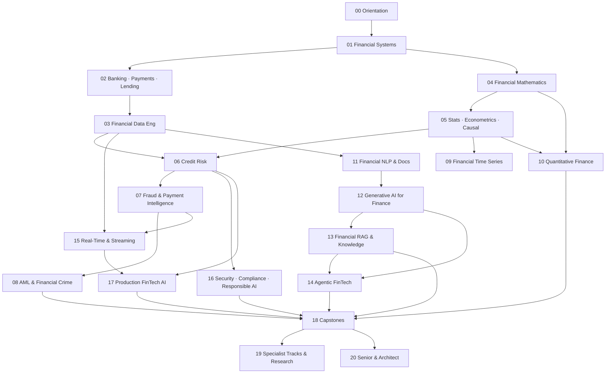

# ROADMAP — From AI Engineer to FinTech AI Architect

> 21 phases across 6 stages. Hard prerequisites are explicit; everything else is sequencing advice.
> Pacing options and weekly schedules live in [`docs/07-execution-plan.md`](docs/07-execution-plan.md).

---

## Design Logic (why this architecture)

The naive approach to "AI → FinTech" is either "learn finance, then ML" (two disconnected halves) or "finance-flavored ML tutorials" (no depth either side). This curriculum instead builds a **bridge**:

```text
Existing AI Engineering Knowledge
        ↓  Stage I: acquire the domain (how money, banks, payments, lending actually work)
Financial Domain Knowledge
        ↓  Stage II: acquire the data + math substrate finance runs on
Financial Data + Mathematics
        ↓  Stage III: the three money-critical ML domains (credit, fraud, AML) + forecasting
Financial ML
        ↓  Stage IV: markets literacy to collaborate with quant teams
FinTech AI Systems
        ↓  Stage V: NLP, GenAI, RAG, agents, real-time — the modern AI stack applied to finance
Production FinTech Engineering
        ↓  Stage VI: compliance, production engineering, capstones, architecture, leadership
Senior / Architect Level
```

Deliberate redesigns vs a generic phase list:

- **Banking + payments + lending operations are ONE phase (02)** — they are one operating reality (a loan is a product sold by a bank, settled through payment rails, serviced by systems) and splitting them produces siloed knowledge.
- **Credit, fraud, AML get full phases (06-08)** — they are the highest-value, most-hired, most-regulated ML problems in finance; they deserve depth, not a "risk" umbrella.
- **Statistics & causal inference precede all financial ML (05)** — selection bias, leakage, and backtest overfitting are *the* failure modes of financial ML, and they are learnable before touching credit data.
- **Real-time/streaming is its own phase (15)** — auth-time decisioning is an architecture problem as much as a modeling problem.
- **Compliance is a peer of production (16+17)** — in finance, governance is not an afterthought of deployment.

---

## Stage I — Domain Bridge (Phases 00-02)

*Goal: speak finance before you model it. Duration: 7-9 weeks.*

| Phase | Name | Weeks | Hard prerequisites | Gate to next stage |
|---|---|---|---|---|
| 00 | Orientation & Baseline | 1 | — | `fintech-lab` repo live with CI; pacing chosen; baseline quiz logged |
| 01 | Financial Systems Foundations | 3-4 | 00 | Explain a bank balance sheet, the yield curve, and 2008 without notes; TVM library shipped |
| 02 | Banking, Payments & Lending Operations | 3-4 | 01 | Walk a card payment end-to-end; idempotent payment state machine shipped |

## Stage II — Data & Quantitative Core (Phases 03-05)

*Goal: the substrate finance ML stands on. Duration: 11-13 weeks.*

| Phase | Name | Weeks | Hard prerequisites | Gate |
|---|---|---|---|---|
| 03 | Financial Data Engineering | 3-4 | 02 | Point-in-time-correct feature pipeline on LendingClub; CDC pipeline shipped |
| 04 | Financial Mathematics | 4-5 | 01 | Monte Carlo pricer, duration/convexity calc, efficient frontier shipped |
| 05 | Statistics, Econometrics & Causal Inference | 4 | 04 | Purged K-fold implemented AND the leakage it prevents demonstrated |

## Stage III — Core Financial ML (Phases 06-09)

*Goal: the three highest-value applied ML domains plus forecasting. Duration: 18-19 weeks. This is the employable core.*

| Phase | Name | Weeks | Hard prerequisites | Gate |
|---|---|---|---|---|
| 06 | Credit Risk & Decisioning | 5-6 | 03, 04, 05 | Calibrated PD model + reason codes + SR 11-7-shaped MDD; risk-committee talk recorded |
| 07 | Fraud Detection & Payment Intelligence | 5 | 06 (soft) | Cost-sensitive fraud model with profit metric; real-time scoring preview |
| 08 | AML & Financial Crime | 4 | 07 (soft) | Sanctions screener + rules TM engine + GNN on Elliptic |
| 09 | Financial Time Series & Forecasting | 4 | 05 | Walk-forward forecast with honest eval; triple-barrier labeling demo |

## Stage IV — Markets & Quant (Phase 10)

*Goal: collaborate with quant teams credibly. Duration: 5-6 weeks.*

| Phase | Name | Weeks | Hard prerequisites | Gate |
|---|---|---|---|---|
| 10 | Quantitative Finance for AI Engineers | 5-6 | 04, 05 | 3-method VaR engine with backtest; cost-honest strategy backtest; greeks fluency |

## Stage V — Advanced Financial AI (Phases 11-15)

*Goal: the modern AI stack — NLP, GenAI, RAG, agents, real-time — deployed against financial constraints. Duration: 18-20 weeks.*

| Phase | Name | Weeks | Hard prerequisites | Gate |
|---|---|---|---|---|
| 11 | Financial NLP & Document Intelligence | 4 | 03 | FinBERT vs L&M benchmark; extraction pipeline with span-F1 |
| 12 | Generative AI for Finance | 3-4 | 11 | Citation-forced copilot + numeric-fidelity checker + eval harness in CI |
| 13 | Financial RAG & Knowledge Systems | 4 | 12 | RAG over filings with ACLs, version filters, and full eval |
| 14 | Agentic FinTech Systems | 3-4 | 12, 13 | Reconciliation agent with audit trail + approval gates |
| 15 | Real-Time & Streaming Financial AI | 3-4 | 03, 07 | End-to-end Kafka→Flink→scoring path at p99 <100ms with rules fallback |

## Stage VI — Production, Compliance & Leadership (Phases 16-20)

*Goal: ship governed systems; become senior. Duration: ongoing; 23+ weeks minimum.*

| Phase | Name | Weeks | Hard prerequisites | Gate |
|---|---|---|---|---|
| 16 | Security, Compliance & Responsible AI | 3-4 | 06 | SR 11-7 dossier + fairness audit + threat model shipped |
| 17 | Production FinTech AI Engineering | 4-5 | 06, 15 | Full MLOps pipeline: registry→serving→drift→audit store |
| 18 | Capstone Systems | 8-12 | 16, 17 + flagship prerequisites | 1-2 flagships deployed, documented, defended |
| 19 | Specialist Tracks & Research Frontier | ongoing | 18 | 2-3 electives with artifacts; research note published |
| 20 | Senior & Architect Level | ongoing | 18 | 6 timed design docs; public writing artifact; promotion-packet self-review |

---

## Dependency Graph



**Soft dependencies** (can study in parallel, better in order): 07→08, 09→10, 11→12.

---

## Milestone Gates (promotion bars between stages)

| Crossing | You must show |
|---|---|
| I → II | Ledger simulator + payment state machine + yield-curve analysis; oral self-exam recorded (financial systems) |
| II → III | PIT-correct feature pipeline + purged K-fold leakage demo + Monte Carlo pricer |
| III → IV | Calibrated credit model with reasons + fraud model with profit metric + AML mini-stack; the "employable core" evidence pack |
| IV → V | VaR engine + honest backtest; ability to hold a quant conversation |
| V → VI | One Advanced-AI system (RAG/copilot/agent) with evals and audit trail + streaming path at latency budget |
| VI → Senior | Deployed flagship with governance pack + 6 design docs + public writing |

Each gate's full criteria: [`docs/06-mastery-framework.md`](docs/06-mastery-framework.md).

---

## Pacing

| Plan | Total | Stage splits | Who it fits |
|---|---|---|---|
| Sprint | 12 months | I:2mo · II:3mo · III:4mo · IV:1mo · V:4mo · VI: parallel+capstone | 20+ h/week, some finance exposure |
| **Standard (default)** | **18 months** | I:3mo · II:4mo · III:6mo · IV:1.5mo · V:6mo · VI:8mo+ | 12-15 h/week alongside a job |
| Deep | 24-30 months | adds research depth, 2 capstones, electives | 8-10 h/week, maximum retention |

Weekly hour budgets, daily workflows, and the revision system: [`docs/07-execution-plan.md`](docs/07-execution-plan.md).

---

## What You Will Have Built (end state)

- A GitHub repository that is simultaneously curriculum, knowledge base, and portfolio.
- 25+ artifacts: from a bond-pricing library to a deployed, governed, real-time fraud platform.
- 1-2 flagship systems with PRDs, architecture docs, evals, compliance dossiers, and demo videos.
- A research log across 8 frontier areas and a public writing habit.
- The interview readiness matrix: [`interview-prep/README.md`](interview-prep/README.md).
