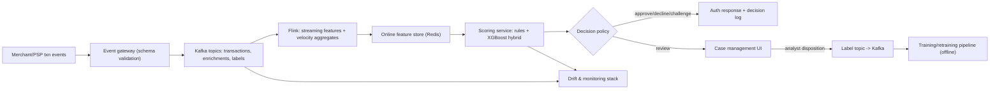

# Flagship 01 — Real-Time Fraud Detection Platform

> **Level 4** · **Feeds capstone option** · **Phases: [07 Fraud Detection & Payment Intelligence](../../phases/07-fraud-payment-intelligence/README.md), [15 Real-Time & Streaming Financial AI](../../phases/15-real-time-streaming/README.md), [17 Production FinTech AI Engineering](../../phases/17-production-fintech-ai/README.md)** · **Est. 8-10 weeks**

## 1. Problem & Users

Card and instant-payment fraud is decided at authorization time: the institution has milliseconds to allow, decline, step-up, or route a transaction for review, and every wrong call costs either fraud loss or a good customer's patience. The problem this flagship solves is an end-to-end real-time scoring platform that combines learned risk with deterministic policy, learns from analyst dispositions, and degrades safely when any component fails.

Primary users and the decisions they make:

- **Authorization system (machine consumer):** needs a decision (approve / decline / challenge) with a score and reason in under 100 ms p99.
- **Fraud analyst:** needs a ranked alert queue with evidence attached (why this transaction scored 0.87) and a disposition workflow that feeds labels back.
- **Fraud strategy lead:** needs threshold tuning against an alert-capacity budget, rule/model conflict views, and drift reports they can take to a risk committee.
- **Model risk reviewer:** needs lineage from raw event to decision, versioned features, and reproducible offline evaluation.

Secondary users: data engineers who own the streaming pipeline, and the payments product team that cares about false-decline rates by segment.

## 2. Business Value

- Direct loss avoidance: every basis point of detected fraud that does not become net loss drops to the bottom line; publicly reported industry fraud-loss rates run from single basis points (card-present, mature programs) to order-of-magnitude higher for instant payments and new products (industry estimates — validate for your assumed portfolio).
- False-decline avoidance is frequently larger than fraud loss itself: declined legitimate purchases are lost revenue, customer attrition, and call-center cost. The platform's threshold design must price both sides.
- Operational leverage: alert precision at a fixed analyst capacity is the number a fraud operations budget actually consumes — improving precision at constant capacity is a direct cost saving.
- Regulatory posture: fraud controls interact with customer-protection obligations (declines must be justifiable; in some jurisdictions scam-reimbursement rules change the receiving-side economics — see `/case-studies/README.md`).

## 3. Dataset(s)

| Dataset | Role | Notes |
|---------|------|-------|
| [IEEE-CIS Fraud Detection (Vesta)](https://www.kaggle.com/c/ieee-fraud-detection) | Primary supervised dataset | ~590k labeled transactions, hundreds of identity/transaction features; the de facto public benchmark for transaction fraud ML |
| ULB Credit Card Fraud (European cardholders) | Class-imbalance and calibration stress test | ~284k transactions, 0.172% fraud; PCA features force focus on methodology, not feature craft |
| Synthetic streaming event feed (self-built from both) | Realistic replay source | Kafka producer replaying transactions with accelerated clock and injected drift/attacks |

Honest limitations: no public dataset exposes a live adversary, a real case-management population, or true merchant economics; the replay feed and injected concept shifts stand in for them. State this in the writeup.

Data quality traps specific to this build:

- IEEE-CIS's `D1`-`D15` timedelta features and ULB's PCA features tempt you into treating them as stable production features — document that they are benchmark artifacts, and design your own features separately.
- Time fields in IEEE-CIS are offsets, not timestamps; the split protocol must be derived from them carefully or your "temporal" split leaks.
- The replay feed's clock acceleration will interact with TTLs and watermarks in ways batch thinking does not predict; test at the accelerated rate you plan to demo.
- Labels from dispositions are biased toward what your own rules flagged — measure and report that bias before training on the feedback loop.

## 4. Reference Architecture (mermaid flowchart + prose)

Prose: transactions land on Kafka with a validated schema; a Flink job maintains stateful features (card velocity, merchant risk, amount z-scores against profile) keyed by card/account, flushed to an online store with TTLs. The scoring service assembles a feature vector from the online store plus request-time values, runs a deterministic rules layer (blocklists, sanctions, hard velocity limits) and a gradient-boosting model, and merges both through a governed decision policy. Every decision is logged with feature snapshot and model version. Analyst dispositions flow back as labels — including confirmed-good (not just confirmed-fraud), which is what keeps training data honest. An offline path reuses the same transformation code for training, closing the parity loop.

## 5. Tech Stack

| Layer | Technology | Why |
|-------|-----------|-----|
| Transport | Kafka (Redpanda acceptable) | Durable, replayable event backbone; the label feedback loop is just another topic |
| Stream processing | Apache Flink (or Kafka Streams) | Stateful per-key aggregates with event-time watermarks — velocity features are the core |
| Online store | Redis | Sub-millisecond reads; TTLs map to feature freshness windows |
| Offline store | Parquet + DuckDB/Spark | Training data assembly reusing transformation code |
| Models | XGBoost/LightGBM; monotonic constraints where defensible | Standard for tabular fraud; SHAP for alert evidence |
| Serving | FastAPI or gRPC service, Docker | Latency-critical path; gRPC preferred for p99 discipline |
| Case management | Small React/Streamlit app + Postgres | Analyst queue, evidence view, disposition capture |
| Monitoring | Prometheus/Grafana + Evidently/NannyML | System health + data drift, separated |

## 6. ML/AI Approach

1. **Rules + model hybrid.** Deterministic scenarios (sanctions, hard velocity, known-bad entities) are non-negotiable guardrails; the model scores the residual space. Rules decisions are logged with the same schema as model decisions so strategy can compare them on one dashboard.
2. **Supervised scoring.** Gradient boosting on transaction + identity + velocity features; class weighting or focal-style loss for imbalance; early split protocol keeps a time-based holdout — never random splits on event data.
3. **Calibration and thresholding.** Isotonic calibration on a temporal holdout; thresholds chosen against the alert-capacity constraint and a cost matrix (fraud loss vs review cost vs customer-friction proxy), not a default 0.5.
4. **Evidence generation.** Per-alert SHAP attributions mapped to human-readable reason categories; rules hits shown alongside model drivers.
5. **Feedback-aware retraining.** Retraining pipeline ingests analyst dispositions; measure the population you *review* separately from what you *auto-approve* — auto-approval censors labels and must be acknowledged in evaluation (selection bias).
6. **Drift handling.** Feature-level PSI plus score-distribution monitoring; a champion/challenger slot lets a retrained model shadow-score before promotion.

## 7. Evaluation Plan (finance-aware metrics + targets)

| Metric | Target | Why it matters |
|--------|--------|----------------|
| PR-AUC (time-split holdout) | ≥ 3x the naive baseline's PR-AUC on ULB; report absolute value on IEEE-CIS | Ranking under extreme imbalance; the standard fraud benchmark |
| Alert precision at capacity K | e.g. precision@100-alerts/day-per-analyst budget ≥ 0.5 (dataset-dependent, justify) | The number the operations budget consumes |
| Expected profit per 1k txns | Positive and maximized at the chosen threshold; report vs rules-only baseline | Ties the model to money, both error types priced |
| p99 scoring latency | < 100 ms end-to-end (gateway → decision), measured under load | The hard production constraint |
| Calibration (Brier / reliability) | Post-isotonic Brier materially below uncalibrated | Thresholds and profit math consume probabilities |
| Recall on fraud value (not count) | Report value-weighted recall | Fraud value is not uniformly distributed across fraud count |
| Feedback contamination check | Train-with-labels vs train-without ablation documented | Proves the feedback loop helps and quantifies censoring bias |

Offline wins do not guarantee online wins; if you simulate A/B with the replay feed, label the simulation clearly as a simulation.

## 8. Security & Compliance Considerations

- **Data minimization:** mask/holderize identifiers in the case UI; encrypt at rest and in transit; never commit raw transaction data to the repo — ship a synthetic generator instead.
- **Decision auditability:** every decline/challenge must be reconstructible years later (feature snapshot, model version, policy version). Retention policy stated in the README.
- **Customer impact:** false declines carry fairness sensitivity (segment analysis of decline rates is mandatory, not optional); document the dispute/appeal path design even if not implemented.
- **Adversarial awareness:** document known attack surfaces (velocity gaming, feature poisoning through feedback), and why thresholds on feedback ingestion are controlled.
- **Regulatory context to cite:** DORA applies to EU financial entities since Jan 2025 (ICT resilience expectations for this stack); model governance follows SR 11-7-style documentation; if extended to receiving-side scam detection in the UK, the mandatory reimbursement regime effective 7 Oct 2024 changes the cost matrix — reference, don't simulate, the rules.
- **Feedback-loop integrity as a control:** the label pipeline is an attack surface (poisoning via fabricated analyst accounts is a real-world concern in industry write-ups); role-separate disposition rights and monitor label-source statistics.
- **Secrets and dependencies:** no credentials in code or compose files; dependency scanning in CI; the demo must survive an offline build.
- **Privacy of behavioral features:** velocity features embed customer behavior patterns; document retention windows and the aggregation rationale even in a synthetic demo — the habit is the deliverable.

## 9. Deployment Architecture

Single-node compose stack for the portfolio deployment: Kafka, Flink job, Redis, scoring service, case UI, Postgres (case data + decision log), Prometheus/Grafana, and a replay producer. The scoring service is stateless and horizontally scalable; the online store is the only hot dependency, with a documented fallback path (request-time features only + model with reduced feature set + policy-only mode) when Redis is degraded — chaos-test this path deliberately. Decision log writes are asynchronous with a local buffer: a monitoring outage must never block an authorization. Load test with `wrk`/`k6` against the full path and record the latency distribution in EVAL.md.

## 10. Milestones (weekly plan)

| Week | Milestone | Exit evidence |
|------|-----------|---------------|
| 1 | PRD + data contract; IEEE-CIS/ULB data audit; baseline rules engine | PRD, data_contract.md, rules baseline metrics |
| 2 | Offline feature pipeline + first model, time-split evaluation | Notebook/script + EVAL v0 |
| 3 | Kafka + replay producer; Flink velocity features; parity tests offline-vs-stream | Parity test in CI |
| 4 | Scoring service with hybrid decision policy; decision log schema | Local API with load-test numbers |
| 5 | Online store integration; full-path latency tuning | p99 measured; fallback tested |
| 6 | Case management UI + feedback topic → training data | End-to-end disposition loop demo |
| 7 | Monitoring: PSI, score drift, alert precision tracking; drift injection experiment | Grafana screenshots; incident runbook v1 |
| 8 | Calibration + threshold economics finalized; champion/challenger shadow mode | EVAL.md final; threshold memo |
| 9 | Hardening: chaos tests, secrets, container scanning; writeup | Recorded walkthrough; README final |
| 10 | (Buffer) stretch goals or L6 polish | — |

Delivery checklist (all must be true before you call this done):

- [ ] Full-path demo runs from a clean clone with one command.
- [ ] EVAL.md contains every table with seeds and split protocol.
- [ ] p99 latency measured under load, recorded, and reproducible.
- [ ] Fallback paths demonstrated by fault injection, not just described.
- [ ] Decision-log reconstruction of any past decision works.
- [ ] Recorded 10-minute walkthrough filed under `/notes/artifacts/`.
- [ ] Limitations section names what is simulated and what would break at real scale.

## 11. Difficulty / Resume Value / Research Potential

- **Difficulty ★★★★☆:** three hard disciplines intersect — stateful streaming, latency-critical serving, and imbalanced supervised learning. The streaming layer is usually the one that hurts; the evaluation discipline is the one most often faked.
- **Resume value:** this is a headline project for fraud/payments ML engineering roles; it demonstrates you can carry a model through the entire path an issuer actually runs, and you can speak fluently to precision-at-capacity and threshold economics. The recorded walkthrough gives you a ready answer to "tell me about a complex system you built."
- **Research potential:** genuine open problems remain reachable from here — online learning against adaptive adversaries, label-censoring-aware training, conformal scoring for decision confidence, and GraphRAG-style entity context for mule detection (see L5/P26). Working code from this flagship is a credible substrate for a workshop-paper-scale experiment.

## 12. Stretch Goals

- Graph features: merchant-card bipartite projections for mule-ring detection feeding the scorer as features.
- Conformal prediction sets for a "review with confidence" queue.
- Adaptive simulation harness: a scripted adversary that adapts to your rules, to test drift response.
- Extend the decision policy with expected-value pricing across decline/challenge/allow actions (step-up authentication economics).
- Port scoring to an ONNX/TensorRT runtime and quantify the latency/throughput gain.
