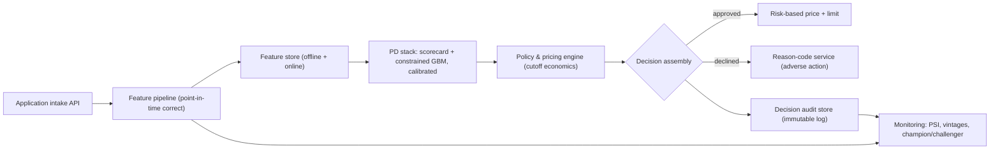

# Flagship 02 — Credit Risk Decisioning System

> **Level 4** · **Feeds capstone option** · **Phases: [06 Credit Risk & Decisioning](../../phases/06-credit-risk/README.md), [16 Security, Compliance & Responsible AI](../../phases/16-security-compliance-responsible-ai/README.md), [17 Production FinTech AI Engineering](../../phases/17-production-fintech-ai/README.md)** · **Est. 8-10 weeks**

## 1. Problem & Users

A consumer lender's core loop is: application in, decision out — approve or decline, at what price, with what reasons, and with what evidence that the whole thing is governed. This flagship builds that loop end to end: an application intake API, a point-in-time-correct feature pipeline, a calibrated probability-of-default stack (scorecard + constrained gradient boosting), a policy and pricing engine that turns PD into a lendable decision, an adverse-action reason-code service, and the monitoring plus SR 11-7-style documentation pack a validator would expect.

Primary users:

- **Credit risk officer:** owns the cutoff and the swap-set consequences of model changes; needs profit views, not AUC.
- **Loan operations:** submits applications and needs deterministic, retry-safe decisions with auditable outputs.
- **Compliance officer:** reviews adverse-action letters, fairness testing, and the model inventory entry.
- **Independent validator (simulated):** re-runs the model from documentation and checks every number in the writeup is reproducible.

## 2. Business Value

- Pricing and approval are the two levers that determine lending P&L; a 1-percentage-point PD miscalibration across a book silently misprices every loan (see Phase 06).
- Reason codes are a legal requirement for adverse action in the US (ECOA/Reg B; CFPB Circular 2022-03 addresses complex models) — automation without defensible reasons is a compliance liability, not a product.
- A governed decision stack (policy + model + reasons + audit) is the difference between a demo and something a lender could put through validation; this project is that difference made concrete.
- The monitoring layer (PSI, vintage tracking, champion/challenger) operationalizes the fact that credit labels arrive 12-24 months late — stability signals are all you get in year one.

## 3. Dataset(s)

| Dataset | Role | Notes |
|---------|------|-------|
| LendingClub loan data (public copies) | Primary application + performance data | Origination features + post-origination outcomes; enables reject-inference style experiments and vintage curves |
| Home Credit Default Risk | Multi-table bureau-style feature engineering | Sk_ID_CURR joins across bureau/previous-application tables; the feature-PIT audit target |
| FICO HELOC | challenging PD benchmark with reason-code-friendly features | Structured, well-documented risk characteristics; good for constrained models |

Limitations to state honestly: public datasets are already selected by past approval policies (censoring), LendingClub grade is a strong feature with leakage temptation, and none of these reflect a lender's real policy overlays. The reject-inference experiment (from Phase 06) is mandatory here precisely because of the censoring.

Data quality traps specific to this build:

- LendingClub's post-decision fields (recoveries, last payment dates, grade updates) are classic silent leakage — build the exclusion list before the first feature, not after the first suspicious AUC.
- Home Credit's bureau tables have their own observation windows; a naive aggregation joins future bureau states into past applications — the PIT audit exists for exactly this.
- FICO HELOC's special-value codes (-7, -8, -9) are not missing values; treating them as numeric is a documented way to destroy monotonicity.
- Outcome definitions differ across datasets (charge-off vs default vs delinquency); pin one definition per experiment and say which.

## 4. Reference Architecture (mermaid flowchart + prose)

Prose: intake normalizes the application and stamps a decision time; every feature is computed from data as-of that timestamp — the pipeline fails closed on future-dated inputs. The PD stack scores in two layers: the scorecard provides the auditable base and native reason codes; the constrained GBM provides the challenger (and optionally a blended score under governance rules). Policy is code: cutoffs, exposure caps, bankruptcy/derogatory hard rules, and segment treatments are configuration under change control, evaluated in profit terms. Every decision writes an immutable record (inputs snapshot, feature values, model version, policy version, reasons). Monitoring consumes the same events.

## 5. Tech Stack

| Layer | Technology | Why |
|-------|-----------|-----|
| Modeling | optbinning/skorecard (scorecard), LightGBM (constrained), scikit-learn (calibration) | Industry-standard scorecard tooling; constrained boosting keeps monotonicity defensible |
| Explainability | SHAP + reason-code mapping layer | Raw SHAP is not a reason code; the mapping layer is the deliverable |
| Feature store | Feast (offline-first) or a lightweight in-house equivalent | Train/serve parity; PIT joins |
| Serving | FastAPI + Postgres (audit store) + Redis (optional online features) | Retry-safe idempotent decision API |
| Orchestration | Prefect or Airflow | Scheduled retraining/monitoring jobs |
| Monitoring | Evidently/NannyML + custom vintage dashboards | PSI/CSI plus cohort views |
| Docs | Model Development Document template (SR 11-7 outline) | Governance artifact as first-class output |

## 6. ML/AI Approach

1. **Scorecard first, always.** WOE/IV binning with monotonicity enforcement, points-to-double-odds scaling; this is the governed base model and the reason-code source of truth.
2. **Constrained challenger.** LightGBM with monotonicity constraints on key characteristics; benchmark vs scorecard on discrimination (AUC/KS) and calibration (Brier, reliability curves) on time-based splits.
3. **Calibration as a pipeline stage.** Isotonic on a separate fold; probabilities must be pricing-grade because the policy engine converts PD to expected loss (PD × LGD × EAD with conservative LGD assumptions).
4. **Reject inference experiment.** Deliberately censor the training sample with a policy rule, quantify the bias of an accepts-only model, and apply one inference method (augmentation or reweighting); document the assumption honestly.
5. **Policy as evaluated code.** Cutoff selection expressed as expected profit per approval-rate scenario; swap-set analysis comparing old/new model approvals.
6. **Reasons.** For declines: scorecard reason codes, or aggregated stable SHAP contributions mapped to a controlled reason dictionary; test output against Reg B expectations (specific, accurate, ranked).
7. **Fairness testing.** Disparate impact ratio and error-rate gaps on available attributes/proxies; document accepted trade-offs with business justification.

## 7. Evaluation Plan (finance-aware metrics + targets)

| Metric | Target | Why it matters |
|--------|--------|----------------|
| Discrimination (AUC/KS), time-split | Challenger ≥ scorecard; KS reported with cutoff | Baseline capability gate |
| Calibration (Brier, reliability curves) | Post-isotonic Brier improvement ≥ 20% vs raw GBM; observed-vs-expected within tolerance bands | Pricing-grade probabilities |
| Expected profit per application at chosen cutoff | Positive and vs scorecard-policy baseline reported | The decision, in money |
| Reason-code stability | Same application → same top-3 reasons across retrains (deterministic test) | Compliance durability |
| Swap-set analysis | Documented approval gains/losses between models | Governance narrative for model change |
| PSI on scores/features (simulated drift) | Alert thresholds defined and justified | Year-one monitoring reality |
| Fairness metrics | Disparate impact ratio reported; gaps documented with mitigation discussion | Regulatory expectations |
| Reject-inference effect | Quantified difference between accepts-only and inference-adjusted models | Honest bias accounting |

## 8. Security & Compliance Considerations

- PII discipline: synthetic or anonymized applicants only in the deployed demo; no real bureau data in the repo.
- Adverse-action correctness is a legal surface: reason codes must be specific, accurate, and stable; include a compliance review checklist in the docs.
- Fair lending: protected attributes excluded from features; proxy-leakage analysis documented (zip/income-source/device-type style features).
- Governance artifacts: model inventory entry, tiering, development document, validation self-review, approved-use statement, and a change-management log — the full SR 11-7-shaped pack, as Phase 16 teaches it.
- Audit store: immutable, retained decision records with feature snapshots; demonstrate reconstruction of any historical decision.
- EU AI Act treats creditworthiness assessment as high-risk (in force Aug 2024, obligations phasing in); document where your design anticipates documentation/human-oversight expectations — verify current phase-in status in your writeup.
- **Determinism as a compliance property:** identical application inputs must yield identical decisions and reasons — no unseeded stochastic components anywhere in the scoring path; test it.
- **Policy change control:** cutoffs, hard rules, and segment treatments are configuration with versioned history; a decision must be explainable by the policy version in force at decision time, not today's.
- **Data retention and purpose limitation:** application data exists to make the applied-for decision; document retention windows and prohibit feature experimentation on retained application data without governance approval.

## 9. Deployment Architecture

Containerized compose deployment: intake API → feature service (online reads + offline backfill) → decision API (idempotent by application ID) → audit store → monitoring jobs on schedule. A "validator mode" script re-runs training from pinned data and seeds and diffs resulting metrics against EVAL.md — reproducibility as a feature. Fallback behavior: if the model service is unavailable, the policy engine continues with scorecard-only decisions (documented degradation), never silent failure. Load profile is modest (origination is batch-friendly) but the API still carries a p95 latency target (< 500 ms) because real origination flows embed it in customer-facing journeys.

Operational notes: batch-scoring mode shares the same decision and audit paths with per-record mode (one code path, two drivers) so batch and API decisions are comparable in review; the audit store grows monotonically and should be partitioned by decision date from day one; and a scheduled "shadow policy" job scores today's applications under tomorrow's proposed policy configuration to generate swap-set previews without changing decisions.

## 10. Milestones (weekly plan)

| Week | Milestone | Exit evidence |
|------|-----------|---------------|
| 1 | PRD + data contract; PIT audit of Home Credit tables; policy assumption memo | docs/PRD.md, PIT findings list |
| 2 | Scorecard v1 (WOE/IV, monotonic, scaled) on German/Taiwan then Home Credit | Binning tables + scaled points |
| 3 | Cutoff economics + reason codes from scorecard; profit worksheet | Policy memo v1 |
| 4 | Constrained GBM challenger + calibration study | Benchmark report |
| 5 | Reject-inference experiment | Experiment log with named assumptions |
| 6 | Feature store + decision API with audit store; parity tests | Running local stack |
| 7 | Reason-code service (SHAP mapping) + stability tests | Compliance review checklist pass |
| 8 | Monitoring: PSI, vintages, champion/challenger wiring | Dashboard + alert thresholds memo |
| 9 | Fairness audit; full SR 11-7-shaped documentation pack | MDD + validation self-review |
| 10 | Hardening, recorded risk-committee walkthrough, writeup | Recording + final README |

Delivery checklist (all must be true before you call this done):

- [ ] One-command local stack: intake → decision → audit record queryable.
- [ ] Validator-mode retrain reproduces every headline number in EVAL.md.
- [ ] Reason codes deterministic across retrains (stability test passing in CI).
- [ ] PIT audit findings closed or explicitly waived with reasons.
- [ ] Model Development Document complete against the SR 11-7 outline.
- [ ] Recorded risk-committee walkthrough filed under `/notes/artifacts/`.

## 11. Difficulty / Resume Value / Research Potential

- **Difficulty ★★★★☆:** the modeling is familiar territory for an ML engineer; the difficulty is governance-grade discipline — PIT correctness, calibration economics, reason stability, and documentation that survives adversarial reading. Most engineers underestimate the documentation; validators do not.
- **Resume value:** the strongest possible signal for credit-risk ML roles: you can present the swap-set memo and the validator-style docs in an interview and be speaking the risk team's native language. Risk-officer-friendly artifacts are rare in candidate portfolios and instantly differentiate.
- **Research potential:** credible extensions include causal reject inference, fair lending under proxy constraints, macro-scenario-conditional PD (IFRS 9/CECL forward-looking overlays), and conformal risk bounds for approval decisions — each a serious study anchored on working infrastructure from this build.

## 12. Stretch Goals

- Add a behavioral scoring service on simulated account history (limit management use case).
- IFRS 9 staging mini-engine: 12-month vs lifetime ECL on simulated cohorts using your PD curves.
- Champion/challenger automation with automated swap-set reports on each candidate promotion.
- Counterfactual "what would change this decision" service alongside reason codes.
- Multi-segment policy optimization (approve rates per segment under a portfolio-level loss constraint).
- Documentation automation: regenerate the MDD's data/model sections from the repo's pinned artifacts on every release, so governance docs cannot drift from reality.
