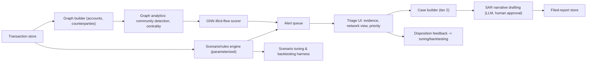

# Flagship 03 — AML Transaction Monitoring Platform

> **Level 4** · **Feeds capstone option** · **Phases: [08 AML & Financial Crime](../../phases/08-aml-financial-crime/README.md), [14 Agentic FinTech Systems](../../phases/14-agentic-fintech/README.md)** · **Est. 8-10 weeks**

## 1. Problem & Users

Transaction monitoring is where financial institutions generate their anti-money-laundering alerts: rules and scenarios fire on suspicious patterns (structuring, rapid movement, layered flows), analysts triage the queue, and the surviving cases become suspicious activity reports (SARs) whose narratives are written by humans under time pressure. The core failure mode of this domain is well documented publicly: enormous alert volumes, low precision, exhausted analysts, and slow adaptation to new typologies. This flagship builds the modernized version of that stack — a scenario engine, graph analytics, a graph neural network scorer, a triage workflow, and LLM-assisted SAR drafting with a human approval gate — plus the tuning and backtesting discipline that keeps the whole thing defensible.

Primary users:

- **AML analyst (tier 1):** works the alert queue; needs evidence-first presentation, not a raw score.
- **AML investigator (tier 2):** builds cases, needs entity/network context and draft narratives to edit, not to trust.
- **Financial-crime technology lead:** owns scenario tuning, model validation, and the tuning/backtesting calendar.
- **BSA/AML compliance officer (simulated):** owns the regulatory narrative and must be able to explain every automated component's role.

## 2. Business Value

- Alert operations cost: publicly reported industry experience puts tier-1 alert closure as the dominant cost of a monitoring program; precision improvements convert directly into analyst capacity or reduced backlog.
- Regulatory exposure: AML program failures have produced multibillion-dollar enforcement outcomes at major banks (publicly reported — see the Danske Bank and HSBC case studies in `/case-studies/README.md`); monitoring effectiveness is examined, not assumed.
- Typology agility: rules alone adapt slowly; models + graph analytics surface coordinated behavior that per-account rules structurally miss.
- SAR quality: drafting support reduces cycle time, but the human author remains accountable — the design bakes that boundary in.

## 3. Dataset(s)

| Dataset | Role | Notes |
|---------|------|-------|
| IBM Synthetic AML world (IBM-AML) | Primary end-to-end simulation | Accounts, transactions, labeled illicit flows with typology structure; supports alerting + graph experiments |
| Elliptic Bitcoin transactions | Graph learning benchmark | ~200k transactions, ~2M edges (order of magnitude, per dataset docs), illicit/licit labels, temporal splits |
| Self-built scenario ground truth (from IBM-AML) | Scenario backtesting | Injected typologies with known parameters for tuning exercises |

Limitations: synthetic data flatters data quality relative to real bank environments (fragmented systems, missing counterparty names — the actual industry pain); Elliptic is crypto-specific with its own label semantics. Say both explicitly in the writeup.

Data quality traps specific to this build:

- IBM-AML's illicit flows are generated with knowable typology parameters; models can memorize generator artifacts — hold out entire typologies, not just random accounts.
- Elliptic's temporal edge distribution means random node splits leak; the temporal split is the only defensible one and the community keeps re-learning this — cite your split in every result.
- Graph construction choices (directed vs undirected, edge weights, time windows) change community structure dramatically; ablate them or your "graph lift" is a construction artifact.
- Alert-level ground truth differs from account-level truth; keep the unit of evaluation explicit everywhere.

## 4. Reference Architecture (mermaid flowchart + prose)

Prose: transactions flow into a parameterized scenario engine (structuring, velocity, geographic exposure, counterparty risk) whose thresholds are configuration, not code. In parallel, a graph layer assembles the transaction network and runs community detection and centrality features; a GNN trained on labeled subgraphs scores entity-level illicit-flow risk. Both feed one alert queue with evidence bundles (triggering rule, contributing transactions, network context, model score with attribution). Tier-1 dispositions feed a tuning harness that backtests threshold changes against known injected typologies. Tier-2 investigators assemble cases; the LLM drafts SAR narratives from case artifacts under strict citation-to-evidence constraints, and nothing is filed without human edit and approval.

## 5. Tech Stack

| Layer | Technology | Why |
|-------|-----------|-----|
| Scenario engine | Python rules engine (yaml-defined scenarios) + DuckDB/Spark | Parameterized, version-controlled scenarios; auditable |
| Graph processing | NetworkX / igraph; PyTorch Geometric for GNN | Community detection at portfolio scale; standard GNN tooling |
| GNN | GraphSAGE / GAT variants, temporal splits | Established baselines on Elliptic; active research through 2025 |
| Triage UI | Streamlit/React + Postgres | Evidence-first queue; fast to build, demoable |
| LLM drafting | Local or API LLM + retrieval over case artifacts | Narrative generation grounded in case evidence |
| Evaluation | Custom harness + MLflow | Alert metrics, backtests, experiment tracking |
| Monitoring | Evidently + custom scenario KPIs | Alert volumes, precision proxies, drift |

## 6. ML/AI Approach

1. **Scenario layer.** Implement 6-10 canonical scenarios with yaml parameters; every alert carries full trigger lineage. This is the regulator-native baseline.
2. **Graph analytics.** Build the account-counterparty graph; run community detection (Louvain/label propagation), compute concentration and cycle features (fan-in/fan-out, layering depth proxies) as both independent alerts and model features.
3. **GNN scoring.** Node classification on Elliptic with temporal train/val/test splits; evaluate precision at review capacity, not accuracy. Then transfer the approach (not the weights) to IBM-AML subgraphs.
4. **Fusion.** Combine scenario hits, graph features, and GNN scores in a triage priority model; the goal is queue ordering under a fixed review budget, not a single "suspicious probability".
5. **SAR drafting.** Retrieval-grounded LLM generation over the case bundle with mandatory citation spans; constrained decoding/templates to enforce required narrative sections; human-in-the-loop approval with tracked edits.
6. **Tuning/backtesting.** Threshold sweeps against injected typologies; measure detection value vs alert volume; document every tuning decision as a governance act (who changed what, why, and the expected impact).

## 7. Evaluation Plan (finance-aware metrics + targets)

| Metric | Target | Why it matters |
|--------|--------|----------------|
| Alert precision at review capacity K | e.g. ≥ 2x rules-only precision on IBM-AML at same alert budget | The operational bottleneck metric |
| Detection value recall | Report % of illicit *value* detected at budget, vs count-based recall | Value concentration is the real exposure |
| Typology coverage | Each injected typology detected by ≥ 1 mechanism; gaps documented | Regulator question #1 |
| GNN benchmark (Elliptic, temporal split) | F1/precision-at-K vs published baselines; no random-split overclaiming | Research hygiene |
| Narrative citation fidelity | 100% of drafted SAR claims traceable to case artifacts (automated check) | Hallucination control |
| Time-to-triage (simulated) | Median analyst steps per alert reduced vs raw-score baseline | Usability evidence |
| Backtest stability | Threshold changes show monotone value/recall trade-off; no knife-edge thresholds | Tuning defensibility |

## 8. Security & Compliance Considerations

- SAR confidentiality: filed-report workflows must not leak to broader audiences; model your access control even in the demo (roles: analyst < investigator < officer).
- Human accountability: the LLM drafts; a human author edits and approves; record the edit history as part of the case file. Frame this as the design invariant it legally is.
- Explainability: every ML-influenced alert must present its drivers (rule hits, graph context, GNN attribution) — a score alone is not triageable and not defensible.
- Model governance: treat the GNN as a model under SR 11-7-style documentation; scenarios as configuration under change control; keep a tuning decision log.
- Data: synthetic only in the repo; no real PII ever. Document the difference between synthetic exercise and production obligations (e.g., FinCEN filing requirements are referenced, not simulated).
- Jurisdictional context: cite the regime your writeup assumes (BSA/FinCEN in the US, AMLD transpositions in the EU) and verify current expectations.
- **Scenario change is a regulated act:** in production, altering thresholds or retiring scenarios is documented and justified — mirror that here with a tuning log reviewers can diff.
- **De-risking harm awareness:** indiscriminate network-flagging can push legitimate customers (and entire corridors) out of banking; your fairness/human-impact section should address it, because regulators publicly have.
- **LLM output governance:** drafted narratives are retained with model/prompt versions and human edits; the model never submits, and the audit trail proves it.

## 9. Deployment Architecture

Compose stack: transaction store (Postgres/Parquet), scenario engine (batch + incremental), graph service (periodic rebuilds), model service (GNN scoring), triage UI, case store, LLM drafting service (with offline fallback if no API access — template-based drafting), and the tuning harness as a scheduled job. Monitoring dashboards track alert volume by scenario, precision proxies from dispositions, and graph job health. Failure behavior: if the GNN service is down, the queue falls back to scenario ordering only (documented degradation, no silent score-free alerts). The whole system must run offline; any LLM calls are optional and swappable (Ollama/vLLM local endpoint for full offline demos).

Operational notes: graph rebuilds are batch-scheduled (real systems rebuild nightly or intra-day, not per-transaction) — document the staleness this implies for network features; alert IDs are immutable across re-scoring rounds so analysts' work is never orphaned by a model refresh; and the tuning harness writes every threshold-change proposal to the tuning log even when rejected, because the rejected changes are what examiners ask about.

## 10. Milestones (weekly plan)

| Week | Milestone | Exit evidence |
|------|-----------|---------------|
| 1 | PRD + data contract; IBM-AML + Elliptic audits; scenario catalog | docs/PRD.md, scenario list |
| 2 | Scenario engine v1 + alert queue baseline; backtesting harness skeleton | Rules-only precision/value metrics |
| 3 | Graph builder + community detection + structural features | Graph feature report |
| 4 | GNN on Elliptic with temporal splits; benchmark vs baselines | Notebook + EVAL entry |
| 5 | GNN + graph features on IBM-AML; fusion priority model | Precision-at-capacity improvement shown |
| 6 | Triage UI with evidence + network view | Demo walkthrough |
| 7 | SAR drafting service with citations + approval workflow | Fidelity checker + UI demo |
| 8 | Tuning/backtesting exercises; tuning decision log | Typology coverage report |
| 9 | Monitoring, governance docs, model doc for GNN | MDD + dashboards |
| 10 | Hardening, recorded walkthrough, writeup | Recording + final README |

Delivery checklist (all must be true before you call this done):

- [ ] Scenario, graph, and GNN alerts all carry evidence bundles in the queue.
- [ ] Temporal-split protocol documented and used in every reported number.
- [ ] Backtesting harness reproduces the tuning decision log end to end.
- [ ] SAR drafting citation checker passes at 100% on the demo corpus.
- [ ] Approval workflow enforced and audit-verified (no LLM-only submissions possible).
- [ ] Recorded walkthrough + typology-coverage report filed.

## 11. Difficulty / Resume Value / Research Potential

- **Difficulty ★★★★☆:** the scenario/graph/GNN integration plus a human-workflow surface is broad; the GNN portion can consume unbounded time — timebox it and let the fusion layer show the value. The hardest engineering is actually the evidence plumbing that makes alerts triageable.
- **Resume value:** headline project for financial-crime technology roles; graph ML plus regulatory workflow is a rare combination, and the tuning/backtesting narrative reads as real industry experience. The SAR-drafting-with-citations component signals you understand where GenAI is and is not acceptable in regulated workflows.
- **Research potential:** active through 2025 — temporal GNNs for AML, imbalanced graph learning, label scarcity and semi-supervised alerting, and LLM agent roles in investigator workflows (see Flagship 06 for the agentic extension). The cross-dataset transfer question alone is a defensible study.

## 12. Stretch Goals

- Temporal GNN (TGN-style) on dynamic graphs for earlier detection.
- Reinforcement-style alert prioritization optimized against simulated analyst capacity.
- Cross-dataset transfer study: train on IBM-AML, evaluate zero-shot on Elliptic-derived subgraphs (and vice versa) with an honest null-result welcome.
- Multi-hop narrative explanation: auto-generate the money-flow path description for an alert from the graph.
- Adversarial typology generator: simulate evasion of your own scenarios and measure degradation.
- Alert-volume forecaster: predict next-month alert load per scenario to support staffing and threshold planning.
