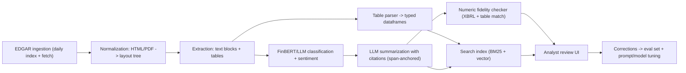

# Flagship 04 — Financial Document Intelligence Platform

> **Level 4** · **Feeds capstone option** · **Phases: [11 Financial NLP & Document Intelligence](../../phases/11-financial-nlp-documents/README.md), [12 Generative AI for Finance](../../phases/12-generative-ai-finance/README.md)** · **Est. 6-8 weeks**

## 1. Problem & Users

Financial analysis is document-shaped: 10-Ks and 10-Qs, prospectuses, policy documents, and research all arrive as long, semi-structured PDFs/HTML where the hardest content is tabular numbers and cross-references. Analysts lose hours to manual extraction and remain the control point for correctness — an LLM that misquotes a number is worse than no LLM. This flagship builds a document intelligence platform that ingests SEC filings, extracts text and tables with layout awareness, classifies and summarizes with citations, checks numeric fidelity against source, and serves searchable, reviewable output to analysts.

Primary users:

- **Equity/credit analyst:** needs filings summarized with page-anchored citations and tables extracted cleanly into dataframes.
- **Research operations:** owns the pipeline health — ingestion coverage, extraction accuracy, review backlog.
- **Quant/factor researcher (secondary):** consumes the structured extraction (e.g., segment revenues, risk-factor changes) as features.
- **Compliance reviewer (secondary):** needs the audit trail of what the machine claimed vs what the document says.

## 2. Business Value

- Analyst hours: document review is a major line item in research workflows; measurable extraction and summarization time savings are the pitch (quantify on your own timed tasks, not vendor claims).
- Numeric fidelity is the trust boundary: a platform that proves its numbers match the source (automated checking) earns adoption that a raw chatbot never will.
- Structured outputs compound: cleaned tables and risk-factor diffs become datasets for downstream models — the platform is a feature factory, not just a reading aid.
- Regulatory and disclosure workflows (monitoring peers, policy tracking) share the same substrate; the architecture generalizes beyond filings.

## 3. Dataset(s)

| Dataset | Role | Notes |
|---------|------|-------|
| SEC EDGAR filings (10-K/10-Q/8-K) | Primary corpus | Full-text + structured (XBRL) data available; Financial Statement Data Sets provide numeric ground truth |
| Financial PhraseBank | Sentiment classification benchmark | Annotated finance sentences; classic FinBERT training/eval set |
| FinQA (and TAT-QA) | Table/numeric QA benchmark | Question-answer pairs requiring arithmetic over financial tables |

Limitations: EDGAR HTML quality varies by filer and era; XBRL gives numeric ground truth for statements but not for MD&A prose; annotate a small held-out set yourself for extraction quality (30-50 tables is enough for a defensible estimate).

Data quality traps specific to this build:

- Amended filings (10-K/A) and restatements mean "the latest filing" is not always the operative document — version awareness is a correctness requirement, not a nice-to-have.
- Units (thousands vs millions) and scale prefixes vary across filers and even sections; unit normalization errors are the most common way extraction looks right and is wrong.
- XBRL tags are consistent-ish, not consistent; custom tags per filer break naive tag-to-concept mappings — build a fallback and report coverage honestly.
- EDGAR rate limits and declared user-agent rules are real conditions of use; bake them into the ingester rather than discovering them in week 3.

## 4. Reference Architecture (mermaid flowchart + prose)

Prose: a scheduled ingester pulls the EDGAR daily index and stores filings immutably. Normalization converts HTML/PDF into a layout tree (pages, sections, paragraphs, tables with bounding info). Extraction splits text blocks and parses tables into typed dataframes with header detection and unit handling — the hardest, highest-value component. Classification layers (document type, sentiment, risk-factor tagging) run with FinBERT and/or an LLM under identical eval protocols. Summarization is span-anchored: every claim carries a pointer to source text, and the numeric fidelity checker verifies quoted figures against parsed tables/XBRL before anything reaches the analyst UI. Corrections from review flow back into the eval set — the platform measures itself against its users' fixes.

## 5. Tech Stack

| Layer | Technology | Why |
|-------|-----------|-----|
| Ingestion | Python + EDGAR full-text/search APIs, rate-limit aware | Public, free, structured disclosure channel |
| Parsing | BeautifulSoup/trafilatura for HTML; pdfplumber/unstructured for PDF; Camelot/table-transformer experiments | Layout-aware extraction is the core IP |
| Tables | Custom parser + validation against XBRL tags where available | Ground truth exists for statements — use it |
| NLP models | FinBERT; LLM (API or local via Ollama/vLLM) for summarize/extract | Two evaluable engines for the same task |
| Retrieval | Postgres + pgvector, or OpenSearch (BM25 + dense hybrid) | Search over sections with metadata filters |
| Review UI | Streamlit/React + Postgres | Side-by-side claim vs source with diff workflow |
| Orchestration | Prefect/Airflow; MLflow for model evals | Scheduled pipeline + experiment discipline |

## 6. ML/AI Approach

1. **Layout-aware extraction before any LLM.** Build the deterministic parsing layer first: sections, tables, units, periods. LLMs sit on top of structure, never in place of it.
2. **Table parsing as the flagship capability.** Header hierarchy, row labels, multi-period columns, unit prefixes; validate every parsed statement table against XBRL-reported values and report match rates per form type.
3. **Classification with dual engines.** FinBERT (fast, cheap, calibrated) and an LLM (flexible, zero-shot) on sentiment and tagging; compare on Financial PhraseBank and your own sampled labels before choosing per-task.
4. **Citation-forced summarization.** Prompts require claim-level span citations; post-processing drops uncited claims; style follows analyst conventions (what changed, what drives it, what to verify).
5. **Numeric fidelity checking.** Extract numbers from generated summaries, normalize units, and match against parsed tables/XBRL within tolerance; fail-closed — unverified numbers are flagged, not silently shipped.
6. **QA over tables.** FinQA/TAT-QA-style numeric QA as a capability and an eval: the platform must answer "what was segment X revenue growth" with computed arithmetic and cited rows.
7. **Feedback loop.** Analyst corrections become regression tests: a correction that once happened must never silently regress.

## 7. Evaluation Plan (finance-aware metrics + targets)

| Metric | Target | Why it matters |
|--------|--------|----------------|
| Table extraction accuracy (cells correct, typed) | ≥ 95% on statement tables vs XBRL; report per form type | The headline capability; ground truth exists |
| Sentiment classification (PhraseBank + own sample) | F1 ≥ published FinBERT baselines (report both engines) | Standard benchmark anchoring |
| Summarization citation rate | ≥ 98% of factual claims carry valid span citations | Trust boundary |
| Numeric fidelity (post-checker) | 100% of shipped numbers verified or flagged; measure pre/post-checker hallucination rate | The compliance-critical metric |
| QA accuracy (FinQA subset) | ≥ published baseline; report arithmetic vs retrieval errors separately | Capability depth |
| Analyst time-to-answer (timed micro-study) | ≥ 40% reduction vs manual on 5 fixed tasks, n≥5 sessions | The business case, measured honestly |
| Ingestion coverage/success rate | ≥ 99% of targeted filings processed without manual repair | Operational health |

## 8. Security & Compliance Considerations

- Public documents, but user annotations may embed sensitive research views — access control on the review layer from day one.
- Audit trail: store raw filings immutably, version every extraction/prompt/model, and log which model produced which summary — regulator-style reproducibility.
- Hallucination policy: the product must fail visible, not silent — unverified numbers are flagged in UI, and the writeup documents the checker's false-negative rate.
- Licensing/ToS: respect EDGAR terms (declared user agent, rate limits); do not redistribute raw filings in the repo — ship the ingester, not the corpus.
- LLM governance: prompts under version control, eval-set regression gates before promotion; document data-residency choice if using an external API.
- Context: this system is decision *support*; the writeup should state that outputs are not investment advice and where human review is mandatory (design principle, not legal disclaimer theater).
- **Amendment handling:** the pipeline must process 10-K/A style amendments and supersede prior summaries explicitly — silently serving a superseded summary is a correctness incident.
- **Model-output retention:** keep the exact prompt, model version, and raw output for every generated summary; analysts' trust depends on being able to ask "which model wrote this, when."
- **Access tiers:** ingestion/search may be public-document based, but analyst annotations and query logs can be commercially sensitive; separate storage and access from day one.

## 9. Deployment Architecture

Compose stack: ingester (cron), normalization/extraction workers, Postgres (+pgvector) or OpenSearch, model services (FinBERT in-process; LLM via local vLLM/Ollama or API with an abstraction layer), review UI, and an eval runner. Batch-first by nature — no hard latency budget, but a freshness target (overnight ingestion completes before market open in your docs). Degradation: if the LLM endpoint is down, classification falls back to FinBERT and summarization queues rather than shipping uncited output. Storage layout keeps raw/immutable and derived/re-computable strictly separated so the whole derived layer can be rebuilt from raw at any time.

Operational notes: the eval runner gates promotion — a change (parser, prompt, model) that regresses the golden set cannot reach the serving path even if unit tests pass; extraction versions are stamped on every derived record so a parser fix can trigger targeted re-extraction; and the review UI's correction statistics (by filer, form type, section) double as the maintenance dashboard showing where the parser still hurts.

## 10. Milestones (weekly plan)

| Week | Milestone | Exit evidence |
|------|-----------|---------------|
| 1 | PRD + data contract; EDGAR ingester for a fixed ticker set | 50+ filings stored immutably |
| 2 | Layout tree + text/section extraction; normalization tests | Section-level parse coverage report |
| 3 | Table parser v1 + XBRL validation harness | Cell-accuracy report on statements |
| 4 | FinBERT + LLM sentiment/tagging with dual-engine eval | Benchmark table (PhraseBank + own sample) |
| 5 | Citation-forced summarization + numeric fidelity checker | Pre/post-checker hallucination rates |
| 6 | Search index (hybrid) + review UI with diff workflow | End-to-end demo |
| 7 | FinQA-style numeric QA capability + eval | FinQA subset results |
| 8 | Feedback regression tests, monitoring, writeup + timed micro-study | Recording + final README |

Delivery checklist (all must be true before you call this done):

- [ ] Ingestion covers your target filing set without manual repair for 7 consecutive runs.
- [ ] XBRL-validated table accuracy reported per form type in EVAL.md.
- [ ] Numeric fidelity checker live in the serving path (fail-visible, not fail-silent).
- [ ] Citation verifier rejects ungrounded claims in an adversarial test set.
- [ ] Review UI diff workflow demonstrated end to end.
- [ ] Timed micro-study protocol and results documented honestly.
- [ ] Recorded walkthrough filed under `/notes/artifacts/`.

## 11. Difficulty / Resume Value / Research Potential

- **Difficulty ★★★★☆:** no single algorithm is exotic; the difficulty is precision — table parsing, unit normalization, and citation enforcement are unforgiving detail work, and EDGAR's heterogeneity is the adversary. Budget twice what you expect for the table parser; it is the project.
- **Resume value:** headline project for doc-AI/LLM roles in finance; "I built numeric fidelity checking and can tell you its false-negative rate" is a differentiated, checkable claim. The dual-engine (FinBERT vs LLM) benchmark shows evaluation maturity vendors rarely demonstrate.
- **Research potential:** table-structure recognition, long-document summarization with faithfulness metrics, benchmark contamination studies for financial LLMs, and agentic research workflows (feeds Flagship 06 patterns). The XBRL-anchored evaluation methodology is itself publishable-adjacent work.

## 12. Stretch Goals

- Risk-factor diff engine: year-over-year 10-K risk-factor alignment with semantic change scoring.
- Earnings-call audio ingestion (ASR → same downstream pipeline) for a multi-modal corpus.
- XBRL-wide factor extraction: build a clean panel dataset from your parsed tables and backtest a simple quality/value factor.
- Fine-tune a small open LLM on your corrections for domain-specific summarization and compare to prompting.
- Streaming update: process 8-Ks intraday with a freshness-sensitive alerting layer.
- Cross-filer consistency audit: flag companies whose numeric disclosures conflict across filings (a compliance-grade anomaly hunt).
