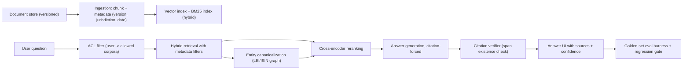

# Flagship 05 — Financial RAG Research Assistant

> **Level 4** · **Feeds capstone option** · **Phases: [12 Generative AI for Finance](../../phases/12-generative-ai-finance/README.md), [13 Financial RAG & Knowledge Systems](../../phases/13-financial-rag-knowledge/README.md)** · **Est. 6-8 weeks**

## 1. Problem & Users

Finance teams need answers grounded in authoritative, versioned, jurisdiction-specific documents: filings, policy manuals, regulatory texts, and internal procedures. Generic RAG demos fail here for domain reasons — stale document versions, entity ambiguity (which "JPMorgan" entity? which ISIN?), jurisdiction-dependent rules, and zero tolerance for uncited numbers. This flagship builds a research assistant that retrieves over a versioned corpus with metadata filters, canonicalizes financial entities through a knowledge graph, forces citations on every claim, and proves itself on a golden evaluation set before anyone trusts it.

Primary users:

- **Research/risk analyst:** asks evidential questions ("What is the counterparty exposure limit under policy v3 in the EU jurisdiction?") and needs cited, current answers.
- **Knowledge/operations owner:** curates the corpus, versions, and access rules; owns the ACL model.
- **Compliance reviewer:** needs the ability to inspect any answer's citations and the system's eval results.

## 2. Business Value

- Time-to-answer on evidential questions is the measurable win; baseline it with your own timed study rather than importing vendor claims.
- Wrong-answer cost is asymmetric and severe: a stale policy version or misattributed entity can drive a wrong decision downstream. Version filters and citations are risk controls, not features.
- The eval harness is itself an asset: a golden question set with graded answers is how financial institutions should accept or reject any RAG vendor claim — building one is the transferable skill.
- Entity canonicalization (LEI/ISIN) is the finance-specific unlock that turns text search into a queryable knowledge system.

## 3. Dataset(s)

| Dataset | Role | Notes |
|---------|------|-------|
| SEC EDGAR filings (subset) | Public evidential corpus | Filings across several years for version-evolution questions |
| Public regulatory/policy texts (e.g., prudential summaries, your own mock policy manual) | Version + jurisdiction exercises | Use genuinely public texts; keep licensing in mind |
| GLEIF LEI data | Entity canonicalization ground truth | Legal-entity identifiers and relationships |
| Self-built golden question set (100-200 Q/A) | The eval harness | Questions with known source spans, distractors, and staleness traps |

Limitations: no internal bank corpus in a public portfolio — build a realistic mock policy corpus (clearly labeled as synthetic) to exercise ACLs and versioning; state that retrieval quality on real proprietary corpora will differ.

## 4. Reference Architecture (mermaid flowchart + prose)

Prose: ingestion chunks documents and attaches structured metadata — document ID, version, effective dates, jurisdiction, source authority — because retrieval without version awareness is a liability generator. Queries pass an ACL filter first (a user never sees chunks they cannot access; enforce at retrieval, not just UI). Hybrid retrieval (BM25 + dense vectors) with metadata filters feeds a cross-encoder reranker; entity mentions are canonicalized through the LEI/ISIN-backed knowledge graph so "the issuer" resolves to the right legal entity. Generation is citation-forced: every claim must bind to a retrieved span, verified post-hoc; unverified claims are dropped. The golden-set harness runs on every index/model/prompt change as a regression gate.

## 5. Tech Stack

| Layer | Technology | Why |
|-------|-----------|-----|
| Indexing | OpenSearch or Postgres+pgvector (BM25 + HNSW) | Hybrid retrieval in one controllable stack |
| Embeddings | A current open embedding model, versioned | Version the model with the index — they are coupled |
| Reranking | Cross-encoder (e.g., a BERT-class reranker) | The highest-leverage quality gain in RAG |
| Knowledge graph | NetworkX/Neo4j with GLEIF LEI + ISIN resolution | Canonical entities, relationships, aliases |
| Generation | API or local LLM (Ollama/vLLM) behind an abstraction | Swappable; local for full offline demos |
| Eval harness | pytest + custom graders (faithfulness, citation validity, staleness) | The differentiating artifact |
| Serving | FastAPI + Streamlit/React UI | Question interface with source viewer |

## 6. ML/AI Approach

1. **Hybrid retrieval with hard filters.** Dense + sparse fusion (e.g., reciprocal rank fusion); jurisdiction/version/date filters applied as hard constraints — retrieval must never see forbidden or superseded content.
2. **Reranking.** Cross-encoder over the fused candidate set; measure nDCG/recall@k deltas; the reranker is usually the best quality-per-effort investment.
3. **Entity canonicalization.** Alias resolution (ticker, ISIN, LEI, common names) into a graph; augment queries with canonical forms; disambiguate with document context and store resolved-entity provenance in answers.
4. **Citation-forced generation.** Structured prompting that requires claim→span bindings; post-generation verification that each citation span exists and supports the claim (embedding similarity + spot-checkable UI).
5. **Staleness control.** Effective-date logic: answers must state the version/period they rely on; conflicting versions across time become explicit, not silent.
6. **Golden-set evaluation.** Question classes: factual lookup, numeric, multi-doc synthesis, staleness trap, jurisdiction trap, negative (answer not in corpus — must refuse). Grade with deterministic checks where possible; LLM-as-judge only with an agreement study against your own grading.

## 7. Evaluation Plan (finance-aware metrics + targets)

| Metric | Target | Why it matters |
|--------|--------|----------------|
| Golden-set answer accuracy | ≥ 90% on factual/lookup classes; report per class | The headline quality number |
| Refusal correctness | ≥ 95% on unanswerable questions | Wrong-confidence answers are the worst failure |
| Citation validity | 100% of citations resolve; ≥ 95% judged supportive | Trust boundary |
| Staleness traps | ≥ 90% correct version selection and disclosure | The finance-specific failure mode |
| Retrieval quality (nDCG@10, recall@20) | Report baseline vs reranked deltas | Component-level attribution |
| ACL enforcement | 100% — zero leaks in the access test suite | Non-negotiable security property |
| Latency p95 | < 5 s end-to-end (interactive class) | Usability target, not a toy constraint |
| LLM-judge agreement | Report judge-vs-human agreement (e.g., Cohen's kappa) before trusting judge grades | Eval integrity |

## 8. Security & Compliance Considerations

- ACLs enforced at retrieval time with tests that prove cross-tenant isolation; never rely on prompt-time politeness.
- Access logging: who asked what, which sources were retrieved, what was answered — retained and reviewable (audit expectation under operational-resilience regimes; DORA applies to EU financial entities since Jan 2025).
- Data boundaries: if using an external LLM API, document what leaves the perimeter and offer a local-model mode; in a real institution this decision belongs to InfoSec, not to the developer.
- Prompt-injection resilience: documents are untrusted input; test injection payloads and keep system instructions and retrieved content structurally separated; cite rather than execute document instructions.
- Source authority: rank official texts above commentary; the UI must make the authority level visible to the analyst.
- Disclaimer discipline: decision support with human verification; the design and the writeup must state where the human check is mandatory.

## 9. Deployment Architecture

Compose stack: index (OpenSearch/pgvector), graph service, retrieval API, generation service (local LLM endpoint for offline capability), eval harness as CI job, and a Streamlit/React UI with source panel. Index rebuilds are versioned and atomic (build → verify with golden set → swap), so a bad re-index can never silently degrade answers. Degradation: if the reranker or graph service is down, retrieval continues un-reranked/un-canonicalized with an explicit quality warning in the UI. The eval harness runs on schedule and on every promotion; results are published to a dashboard — the assistant proves itself continuously or it gets flagged.

## 10. Milestones (weekly plan)

| Week | Milestone | Exit evidence |
|------|-----------|---------------|
| 1 | PRD + corpus selection + data contract; golden-set question design (v0, 50 questions) | docs/PRD.md, question-set draft |
| 2 | Ingestion + chunking + metadata model; BM25 baseline | Retrieval baseline numbers |
| 3 | Dense + hybrid retrieval; filters for version/jurisdiction | nDCG/recall deltas |
| 4 | Cross-encoder reranking; entity canonicalization v1 (LEI) | Rerank delta; alias resolution tests |
| 5 | Citation-forced generation + verifier | Citation validity report |
| 6 | Golden set to 100-200 questions; grading pipeline + judge agreement study | EVAL.md v1 |
| 7 | ACL model + security test suite + injection tests | 100% ACL pass |
| 8 | UI polish, deployment hardening, recorded walkthrough, writeup | Recording + final README |

## 11. Difficulty / Resume Value / Research Potential

- **Difficulty ★★★★☆:** RAG scaffolding is well-trodden; the difficulty is the finance-specific rigor — versioning logic, entity disambiguation, refusal behavior, and an eval harness good enough to catch regressions.
- **Resume value:** headline project for GenAI-in-finance roles; the golden-set harness and ACL test suite are the artifacts interviewers remember because almost nobody builds them.
- **Research potential:** GraphRAG-style retrieval (feeds L5/P26), long-context vs retrieval trade-off studies, agentic query decomposition, and evaluation methodology for faithfulness are all open, publishable-adjacent directions.

## 12. Stretch Goals

- GraphRAG extension: community summaries over the entity graph for portfolio-level questions (bridge to L5/P26).
- Numeric QA with computation: answer "what changed in segment revenue" via extraction + arithmetic rather than retrieval alone.
- Multi-jurisdiction comparative answers with explicit per-jurisdiction citations.
- Personalization with governance: per-team corpora and answer-memory, fully audited.
- Fine-tune or preference-optimize the generator on graded answers to reduce citation failures.
