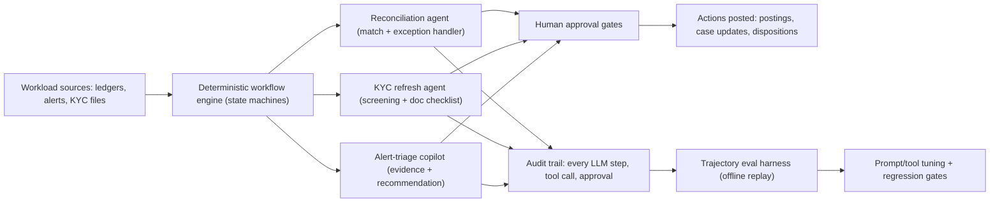

# Flagship 06 — Agentic Compliance Operations Platform

> **Level 4** · **Feeds capstone option** · **Phases: [14 Agentic FinTech Systems](../../phases/14-agentic-fintech/README.md), [16 Security, Compliance & Responsible AI](../../phases/16-security-compliance-responsible-ai/README.md)** · **Est. 8-10 weeks**

## 1. Problem & Users

Compliance operations are full of high-volume, rule-heavy, exception-prone workflows: reconciling positions and payments across systems, refreshing KYC files as documents and risk indicators age, and triaging alert queues where most items are benign but each needs evidence to close. These are precisely the workflows LLM agents promise to help with — and precisely where an uncontrolled agent is unacceptable. This flagship builds an agentic platform with three workers (reconciliation, KYC refresh, alert triage) that operate inside deterministic workflows with hard human approval gates, full audit trails, and trajectory-level evaluation proving the agents behave within their mandate.

Primary users:

- **Operations analyst:** currently does the rote matching and the exception chasing; the agent should hand them clean work or well-evidenced exceptions.
- **Compliance officer:** owns the control framework; must be able to show what the agent may do, what it did, and who approved what.
- **Internal audit / model risk (simulated):** tests the control design and the trajectory logs.
- **Platform engineer:** owns the agent runtime, tool permissions, and monitoring.

## 2. Business Value

- Operational cost: reconciliation and KYC refresh are headcount-heavy; credible industry ambition (publicly stated by many institutions) is to shift human effort from matching to exception judgment — measure the shift on your synthetic workload rather than quoting vendor numbers.
- Error economics: manual matching has its own error rate; a deterministic core with LLM-assisted exceptions can beat both pure-manual and pure-automation on accuracy plus cycle time — that comparison is your evaluation.
- Control credibility: the platform's value proposition to any financial institution is not agent capability but agent *containment*; the audit trail and approval gates are the product.
- Transferability: the pattern (deterministic skeleton + LLM exception handling + gates + trajectory evals) generalizes to any regulated operations workflow.

## 3. Dataset(s)

| Dataset | Role | Notes |
|---------|------|-------|
| IBM Synthetic AML world | Alert-triage copilot scenario source | Alerts + transaction context + outcomes for dispositioning simulation |
| OFAC SDN list + GLEIF LEI data | KYC refresh screening targets | Name screening, entity resolution, refresh-cycle triggers |
| Self-built reconciliation corpus (synthetic ledgers with injected breaks) | Reconciliation agent workload | Generate counterpart streams with controlled break types: amount, missing, timing, FX rounding, duplicates |

Limitations: all workloads are synthetic; real reconciliation data embeds messy upstream system behavior that no public dataset reproduces. Build the synthetic generator with enough pathologies (encoding drift, late postings) to make the agent's life realistically hard, and say so in the writeup.

## 4. Reference Architecture (mermaid flowchart + prose)

Prose: the workflow engine is the authority — agents are invoked at defined steps with defined tools, never free-running over the system. The reconciliation agent performs deterministic matching first; LLM reasoning handles only exceptions (describing likely causes, proposing resolutions, drafting queries for a human). The KYC refresh agent assembles refresh packets: screening hits against SDN with fuzzy-match explanations, document expiry checks, and risk-indicator deltas — decisions remain human. The alert-triage copilot assembles evidence bundles and drafts dispositions with confidence tiers; only below-threshold auto-closures (explicitly configured) skip the human, and even those are logged for sampling review. Every LLM input/output, tool call, and approval is written to an append-only audit store; the trajectory eval harness replays recorded trajectories against graders to catch regressions before promotion.

## 5. Tech Stack

| Layer | Technology | Why |
|-------|-----------|-----|
| Agent runtime | LangGraph (or equivalent state-machine agent framework) | Explicit, inspectable agent graphs; no autonomous loops by default |
| LLM | API or local (Ollama/vLLM) behind an abstraction layer | Swappable; local mode for offline auditability |
| Workflow engine | Temporal-like open framework or explicit Python state machines | Determinism and retries; the compliance backbone |
| Tools | Idempotent, permissioned function registry (matching, screening, retrieval) | Least-privilege tool design |
| Audit store | Append-only Postgres with hash chaining | Tamper-evident trajectory logs |
| Evaluation | Trajectory graders + LLM-as-judge with agreement study | Behavior-level testing, not just output testing |
| UI | Streamlit/React ops console | Review queues, approvals, sampling dashboard |

## 6. ML/AI Approach

1. **Deterministic-first decomposition.** Each workflow starts with the deterministic algorithm (exact/fuzzy matching, rule screening); the LLM is scoped to exception semantics and evidence assembly, where its language strength actually pays.
2. **Tool-using agents with explicit permission scopes.** Each agent has a tool allowlist; every call is logged with arguments and results; no tool writes without a corresponding approval gate where policy requires it.
3. **Grounded reasoning.** Exception explanations must cite the ledger rows/alerts they rely on; the platform verifies cited artifacts exist before displaying the reasoning.
4. **Confidence-tiered autonomy.** Actions are tiered: propose (always human), recommend (human unless below explicit thresholds), auto (configurable, sampled). Thresholds are policy configuration, not code magic.
5. **Trajectory evaluation.** Grade recorded agent trajectories on: task completion, tool-use correctness, citation validity, gate respect, and end-state quality; replay suites run on every prompt/model/tool change.
6. **LLM-as-judge with integrity.** Judge grading is calibrated against your own labeled trajectories; report agreement before trusting it, per the Phase 16 eval standards.

## 7. Evaluation Plan (finance-aware metrics + targets)

| Metric | Target | Why it matters |
|--------|--------|----------------|
| Reconciliation auto-match rate + precision | e.g. ≥ 90% of clean matches auto-cleared at ≥ 99.5% precision (justify thresholds) | The core efficiency claim |
| Exception triage quality | Human-graded usefulness of agent exception bundles ≥ 4/5 on a sampled set | Proves the LLM layer adds value |
| KYC refresh cycle time (simulated) | ≥ 40% reduction vs manual baseline on the same synthetic queue | Business case, measured |
| Triage copilot disposition agreement | Agent recommendation vs reference dispositions ≥ baseline analyst agreement on IBM-AML | Quality gate |
| Gate integrity | 100% of gated actions have prior human approval in the audit trail | Non-negotiable control |
| Trajectory regression suite | Zero critical failures across replay suites before any promotion | Behavioral safety net |
| Audit completeness | Every trajectory reconstructible: inputs, outputs, tool calls, versions | The regulator-facing property |
| Cost per task | LLM tokens + compute per task, tracked and reported | Operations cares about unit economics |

## 8. Security & Compliance Considerations

- Least-privilege tools: each agent can only call tools its mandate allows; demonstrate a permission-violation test failing loudly.
- Human accountability: approvals carry the human identity and timestamp; the writeup documents the RACI for every action type.
- Audit trail: append-only, hash-chained, replayable; the audit reviewer (simulated) must be able to answer "what did the agent know, do, and get approved" for any past task.
- Prompt-injection surface: workload data is untrusted (counterparty names, narrative text); test injection payloads and structural separation of instructions vs data.
- Model change control: prompts, models, and tool registries are versioned; changes route through the trajectory regression suite — treat agent behavior changes like model changes under SR 11-7-style thinking.
- Regulatory framing: this platform touches regulated duties (screening, monitoring); the writeup states plainly that it supports, never replaces, accountable human compliance functions — design and docs must agree.

## 9. Deployment Architecture

Compose stack: workflow engine, three agent services, tool registry, audit store, review/approval UI, and the eval harness in CI. All agent execution is synchronous and observed — no background autonomy beyond the workflow engine's own retries. Degradation: LLM unavailability means workflows continue deterministically with exceptions queued for humans (never blocked, never auto-resolved). Cost controls: token budgets per task with logged overruns. The audit store supports export for the simulated audit review, and the eval harness publishes trend dashboards (gate integrity, auto-match precision, judge scores) so the platform's own health is as visible as its workload.

## 10. Milestones (weekly plan)

| Week | Milestone | Exit evidence |
|------|-----------|---------------|
| 1 | PRD + control framework design; synthetic workload generators (ledgers with breaks) | PRD + generator with break taxonomy |
| 2 | Deterministic reconciliation core + baseline metrics | Auto-match rate/precision baseline |
| 3 | Reconciliation agent (exception handling) + tool registry with permissions | Exception bundle demo |
| 4 | Audit store with hash chaining + trajectory recording | Replay of any past task works |
| 5 | KYC refresh agent (screening vs SDN, doc checklist) | Refresh packet demo with fuzzy-match explanations |
| 6 | Alert-triage copilot on IBM-AML (evidence + confidence tiers) | Disposition agreement numbers |
| 7 | Approval gates + ops console + sampling dashboard | Gate integrity test suite passes |
| 8 | Trajectory eval harness + regression gates + judge agreement study | EVAL.md v1 |
| 9 | Hardening: injection tests, degradation drills, cost tracking | Incident runbook + cost report |
| 10 | Recorded walkthrough (control-framework narrative), writeup | Recording + final README |

## 11. Difficulty / Resume Value / Research Potential

- **Difficulty ★★★★☆:** individually, each agent is moderate; the system difficulty is the control fabric — workflow determinism, permissions, audit completeness, and evaluation at the trajectory level.
- **Resume value:** the most forward-looking of the flagships for roles in applied agentic AI under governance; "trajectory evals and hash-chained audit trails" is language that separates you from prompt-demo portfolios.
- **Research potential:** agent evaluation methodology, safe autonomy tiering, human-AI teaming metrics, and injection-resilient tool use are active research areas directly exercised here (see Phase 19).

## 12. Stretch Goals

- Add a fourth agent (regulatory-change watcher) that drafts policy-impact memos from ingested rule updates.
- Formal verification lite: model-check one workflow's state machine against its policy invariants.
- Active learning loop: analyst corrections train the exception classifier and update confidence tiers.
- Cross-agent orchestration study: when does the triage copilot's output become the KYC agent's input, and how do errors propagate?
- Cost/quality frontier explorer: sweep model size vs task quality to price the autonomy tiers honestly.
