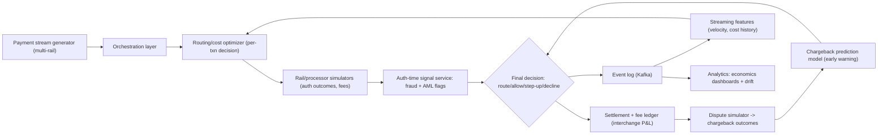

# Flagship 07 — Payment Intelligence Engine

> **Level 4** · **Feeds capstone option** · **Phases: [02 Banking, Payments & Lending Operations](../../phases/02-banking-payments-lending/README.md), [07 Fraud Detection & Payment Intelligence](../../phases/07-fraud-payment-intelligence/README.md), [15 Real-Time & Streaming Financial AI](../../phases/15-real-time-streaming/README.md)** · **Est. 6-8 weeks**

## 1. Problem & Users

A payment is not just a risk event to score — it is a product decision: which rail (card, ACH, instant, wire), which acquirer/processor, at what cost, with which failure and fraud exposure. Modern payment teams run an orchestration layer that routes each transaction to optimize an objective blending cost, approval rate, settlement speed, and risk. This flagship builds that intelligence layer: an anatomy-faithful payment orchestration simulator, a routing/cost optimizer, auth-time fraud and AML signals, interchange economics analysis, and chargeback prediction — all on synthetic streams with realistic fee schedules and IEEE-CIS-derived risk patterns.

Primary users:

- **Payments product manager:** owns authorization rates and processing cost; needs the routing optimizer and its trade-off surface.
- **Risk analyst:** needs auth-time signals (fraud + AML red flags) attached to the payment decision.
- **Finance/interim CFO view (secondary):** cares about the interchange and fee P&L — where every basis point of cost goes, and what routing changes are worth.
- **Chargeback/disputes team:** needs early warning scores and a reason-code view of incoming dispute risk.

## 2. Business Value

- Cost concentration: interchange and scheme/processing fees are among the largest variable costs in payments; publicly available schedule structures (blended vs IC++, card-present vs CNP, cross-border add-ons) mean routing and method steering decisions move real money — model the schedules rather than quoting rates.
- Approval rate is revenue: declined good transactions are lost sales; the routing optimizer must price the fraud/approval trade-off explicitly rather than maximizing either side blindly.
- Chargebacks compound: fee + merchandise loss + operational handling + scheme monitoring-program risk (publicly documented programs exist at the schemes); early prediction changes the response playbook.
- Instant rails raise the stakes: faster settlement (e.g., RTP/FedNow growth — FedNow connection counts and limits are published by the Richmond Fed) shortens the window to stop bad payments, which changes signal design; reference, don't simulate, the rails' rulebooks.

## 3. Dataset(s)

| Dataset | Role | Notes |
|---------|------|-------|
| IEEE-CIS Fraud Detection (Vesta) | Fraud signal realism | Supply the auth-time risk model with realistic feature distributions and label semantics |
| Synthetic payment streams (self-built generator) | Primary workload | Cards + ACH + instant rails; fee schedules, authorization outcomes, dispute windows, mule-pattern injections |
| ULB Credit Card Fraud | Secondary validation of the fraud signal layer | Class-imbalance stress test for the signal components |

Limitations: all economics are simulated from public schedule *structures*, not actual negotiated rates — hedge every cost claim as illustrative. Dispute outcomes depend on issuer/acquirer behavior you cannot observe publicly; the generator encodes assumptions and the writeup lists them.

## 4. Reference Architecture (mermaid flowchart + prose)

Prose: the generator emits a realistic multi-rail stream (amount distributions, merchant categories, geographies, mule/typology injections). The orchestration layer holds rail metadata and the fee schedule model; per transaction, the routing optimizer scores candidate routes on expected cost + approval probability + risk exposure, then the signal service attaches fraud/AML flags computed at auth time; a final decision function combines route choice with risk actions (allow, step-up, decline, redirect to a cheaper rail with acceptable risk). Every outcome writes to the event log; settlement posts fees into an interchange P&L ledger; the dispute simulator resolves chargebacks with reason codes feeding the early-warning model. Streaming features (velocity, approval-rate history by route) feed back into the optimizer — the loop is the point.

## 5. Tech Stack

| Layer | Technology | Why |
|-------|-----------|-----|
| Generator | Python + pandas/NumPy scenario engine | Controlled realism: distributions, fee schedules, typologies |
| Orchestration | FastAPI service + rule/config layer | The production-shaped decision point |
| Optimizer | Expected-value scoring over route candidates; linear programming for portfolio-level constraints | Per-txn EV with portfolio guardrails |
| Streaming | Kafka + Flink (or Kafka Streams) | Feature freshness for routing history/velocity |
| Risk models | XGBoost/LightGBM (fraud signal), gradient boosting (chargeback prediction) | Tabular standards, calibrated probabilities |
| Ledger | Postgres, double-entry style postings | Fee P&L must reconcile — reuse the Phase 01 mindset |
| Analytics | DuckDB + dashboard (Streamlit/Grafana) | Economics drill-downs |

## 6. ML/AI Approach

1. **Cost model before ML.** Encode fee schedules (interchange categories, scheme fees, processing marks, cross-border add-ons) as first-class code with tests — the optimizer is only as honest as this model.
2. **Approval-probability models per route.** Estimate P(approve | txn, route) from simulated authorization outcomes; calibrated probabilities (isotonic) so EV math is sound.
3. **Fraud + AML signals at auth time.** IEEE-CIS-trained fraud scorer (calibrated, time-split validated) plus rule-based AML red flags (velocity, structuring-shaped patterns, counterparty flags); both exposed as signal vectors, not decisions — the decision layer owns the trade-off.
4. **Routing as expected-value optimization.** Per transaction: EV(route) = expected revenue − expected fees − expected fraud loss − expected dispute cost; portfolio-level constraints (e.g., max share per processor) via LP on the EV surface.
5. **Chargeback early warning.** Predict dispute probability and reason-code distribution within the dispute window; feed "dispute-exposure-adjusted routing" back into the optimizer.
6. **Drift-aware loop.** Injection experiments (fee schedule change, new mule typology) test whether features and models detect and adapt; document adaptation lag.

## 7. Evaluation Plan (finance-aware metrics + targets)

| Metric | Target | Why it matters |
|--------|--------|----------------|
| Net processing cost per 1k txns | ≥ 10% reduction vs static-routing baseline (report fee schedule assumptions) | The headline economics number |
| Approval rate at equal fraud loss | ≥ baseline + measurable delta; report the frontier curve, not one point | Revenue side of the trade-off |
| Fraud detection (PR-AUC, value-weighted recall) | ≥ 3x naive baseline on time splits | Signal quality gate |
| Chargeback prediction | PR-AUC with lead-time analysis (score at auth vs dispute arrival) | Early warning usefulness |
| Calibration of P(approve) and dispute models | Brier + reliability curves within tolerance | EV math integrity |
| Ledger reconciliation | 100% — postings balance to the cent in all test runs | The Phase 01 identity applied |
| Latency p99 (decision path) | < 100 ms for auth-time signal + routing decision | Instant-rail realism |
| Drift adaptation lag | Measured txns-to-detection on injected schedule/typology changes | Operational resilience |

## 8. Security & Compliance Considerations

- PAN/data discipline: synthetic PANs only; if any real card data were ever in scope, PCI DSS would govern — the writeup states the boundary explicitly.
- AML exposure: routing/steering must not become evasion — document a control that prohibits optimization away from monitoring obligations (an integrity constraint on the optimizer, logged).
- Scheme and rail rules: reference public rulebook structures; note that production routing must respect scheme authorization and clearing rules — verify current rules in any real deployment.
- Auditability: routing decisions logged with the EV components (cost, approval prob, risk) — a regulator or a merchant should be able to ask "why was this routed here?" and get the math.
- Consumer protection: decline/step-up actions carry reason categories; fairness analysis of decline rates by segment is in scope for this project as in Flagship 01.

## 9. Deployment Architecture

Compose stack: generator → orchestration API → rail simulators → signal service → event log (Kafka) → feature job → analytics dashboards; Postgres ledger and dispute store. The whole loop runs faster than real time for experimentation (replay at 100x with a documented clock abstraction), and at real time for the demo mode. Failure behavior: signal-service outage falls back to conservative routing (higher-cost, lower-risk defaults) with an explicit flag — cost optimization never silently continues without risk signals. Load tests establish the decision-path latency budget; the fee ledger and settlement postings reconcile nightly in a scheduled job whose failures alert.

## 10. Milestones (weekly plan)

| Week | Milestone | Exit evidence |
|------|-----------|---------------|
| 1 | PRD + data contract; payment anatomy doc; fee schedule model with tests | PRD + cost-model unit tests |
| 2 | Stream generator v1 (multi-rail + typologies) | Generator validation notebook |
| 3 | Fraud signal layer (IEEE-CIS model, calibrated) + AML red-flag rules | Signal service with metrics |
| 4 | Orchestration API + static-routing baseline; ledger postings | Baseline cost/approval numbers; reconciliation pass |
| 5 | Routing optimizer (per-txn EV + portfolio LP) | Frontier curve vs baseline |
| 6 | Dispute simulator + chargeback early-warning model | Lead-time analysis report |
| 7 | Streaming features + drift injection experiments | Adaptation-lag measurements |
| 8 | Economics dashboards, hardening, recorded walkthrough, writeup | Recording + final README |

## 11. Difficulty / Resume Value / Research Potential

- **Difficulty ★★★★☆:** the breadth is the challenge — economics, streaming, risk signals, and an optimizer with integrity constraints — though each piece reuses skills from Phases 02/07/15.
- **Resume value:** uniquely differentiating for payments-fintech roles; most candidates can score fraud, almost none can explain interchange economics and route optimization — this project makes you fluent in both.
- **Research potential:** multi-objective routing under uncertainty, adversarial pressure on routing (fraud migration across rails), and cost-aware model deployment are publishable-adjacent directions (see Phase 19).

## 12. Stretch Goals

- Multi-agent negotiation mode: processors as bidding agents (clearly synthetic) vs the EV optimizer.
- BNPL/installment steering: add a product-choice dimension to routing with regulatory-flag handling.
- Cross-border corridor analysis: FX spread and settlement-timing economics per corridor.
- Bandit routing: online learning for route choice with safe exploration bounds.
- Instant-rail scam-reimbursement economics: extend the cost matrix with UK APP-style liability splits (per the Oct 2024 regime) to study receiving-side incentives.
